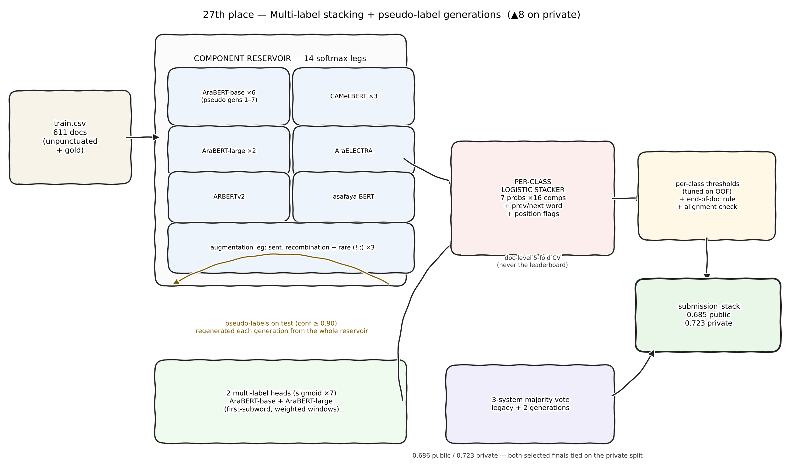
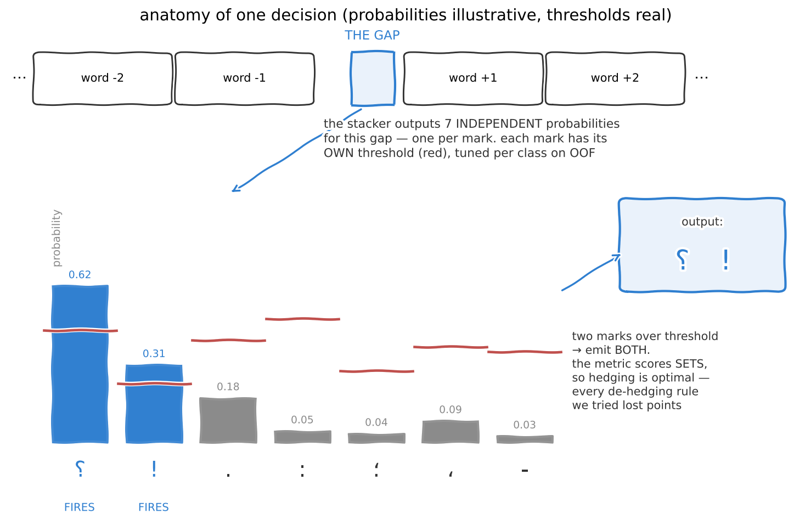
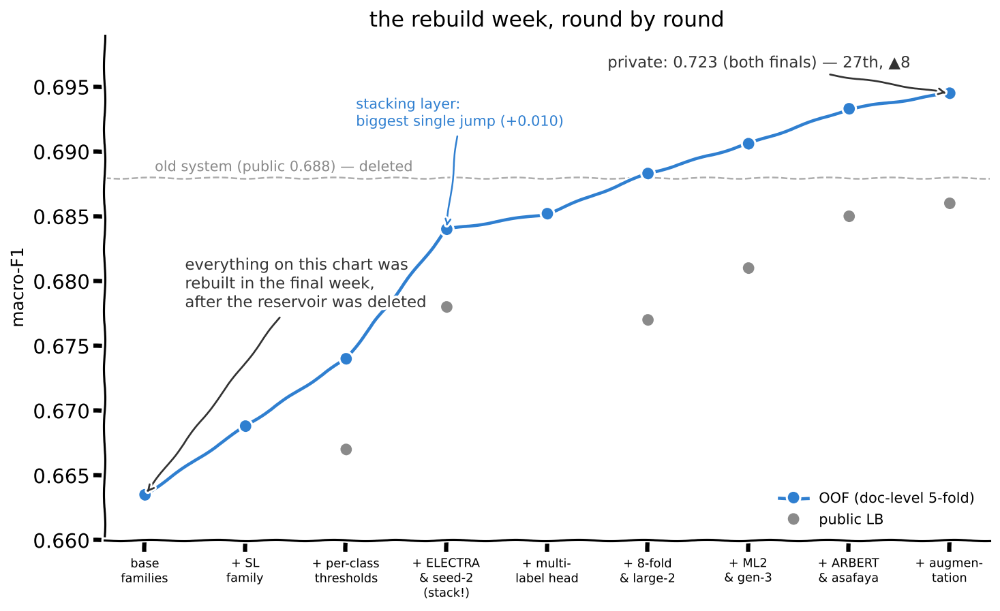
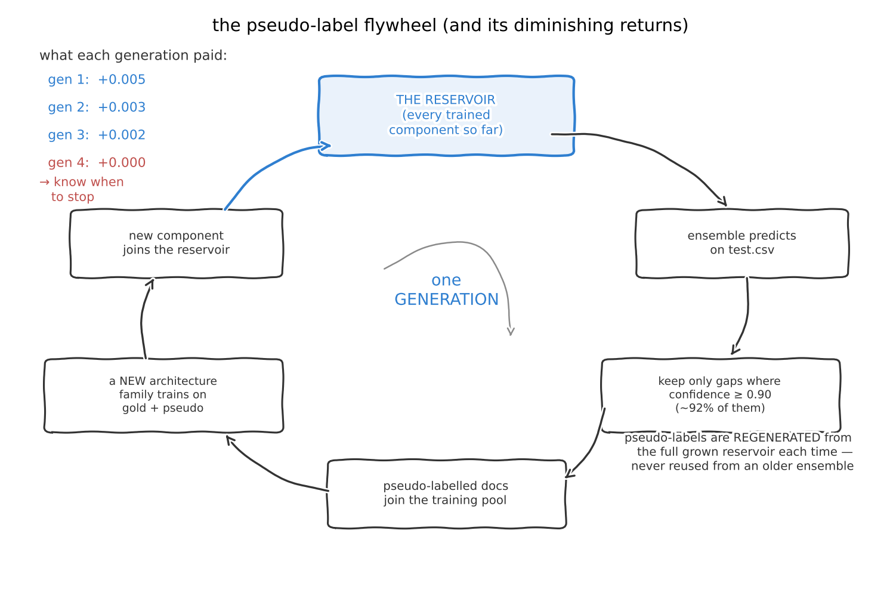
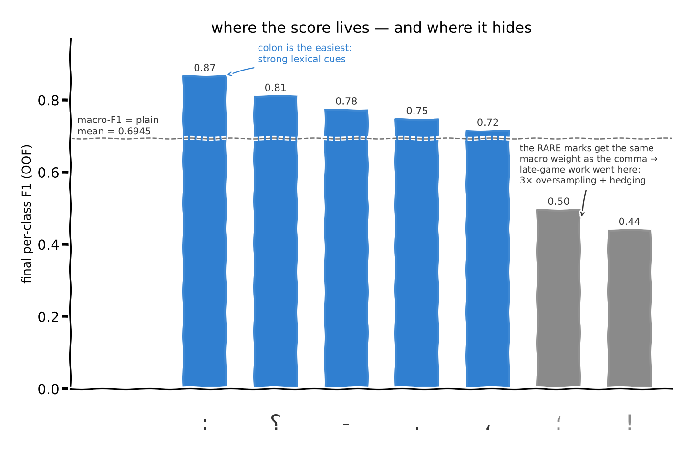
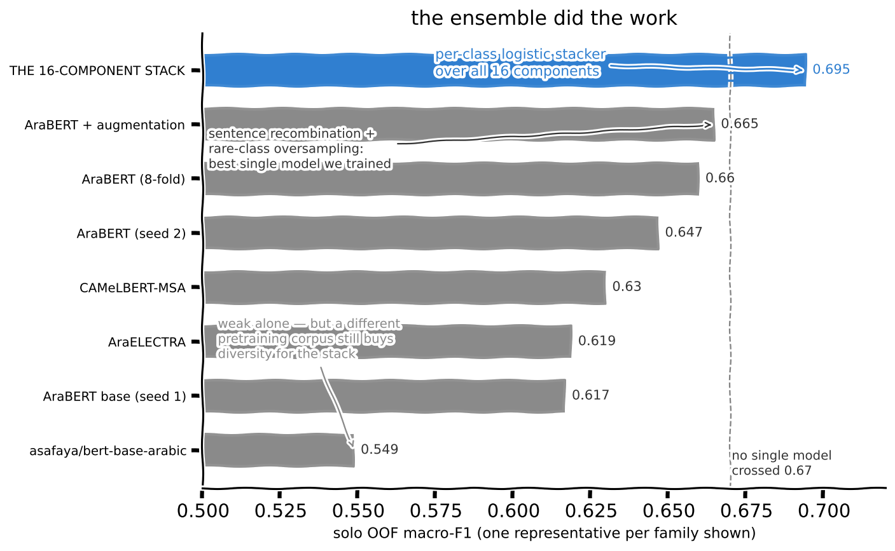
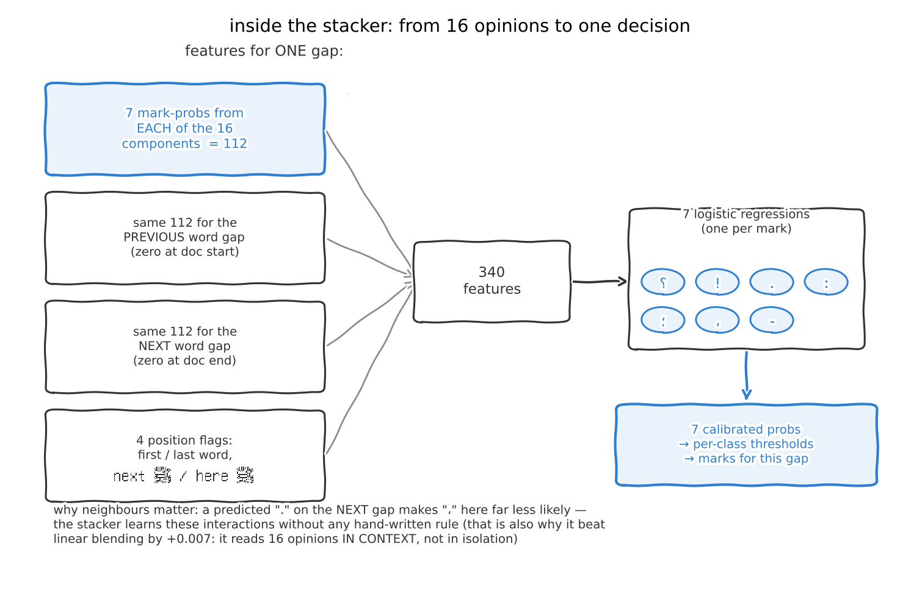
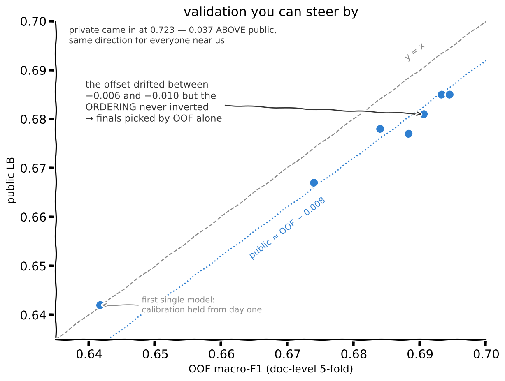
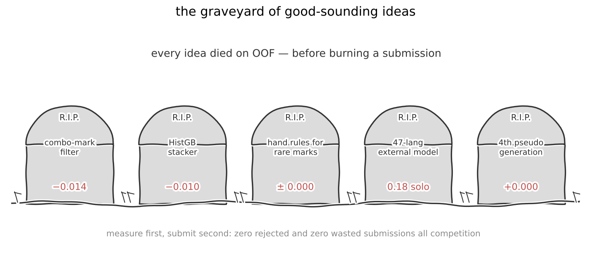

# 27th Place Solution — تحدي مُرقّم (Muraqqam Challenge)

**Arabic Punctuation Restoration · Kaggle community competition with King Salman Global Academy for Arabic Language**

**Nuha Alanezi · Private LB 0.723 · Public LB 0.686 · ▲8 positions on the private shakeup**



## Summary

We treat punctuation restoration as **multi-label classification of word gaps**: seven independent sigmoid decisions per gap, one per mark (`. ، ؟ ! : ؛ -`), each with its own threshold tuned on out-of-fold predictions. One decision looks like this:



The final system is a **16-component ensemble** of Arabic encoders (AraBERT base/large, CAMeLBERT, AraELECTRA, ARBERTv2, asafaya) trained across **multiple pseudo-label generations**, combined by a **per-class logistic stacker** with neighbor-context features. Everything was trained on Kaggle/Colab free T4s, from the provided data only.

The story behind it: **midway through the competition our entire model reservoir was deleted.** Everything below was rebuilt from scratch in the final week — which forced us to automate the whole pipeline into resumable, cache-checkpointed scripts. That accident became the best engineering decision of the competition.



## What mattered most (measured)

| Technique | Gain (OOF) |
|---|---|
| Per-class thresholds instead of argmax decoding | **+0.005** on the same blend |
| Per-class logistic stacking (features: 7 symbol-probs × all components + prev/next word probs + position flags) over linear blending | **+0.007** |
| Sentence-recombination augmentation + 3× oversampling of windows containing `!` and `؛` | best single model: **0.6646** (vs 0.6599 without) |
| Pseudo-labeling (confidence ≥ 0.90), regenerated each generation from the growing ensemble | +0.002–0.005 per generation |
| Each new *architecture family* (multilingual → Arabic-specific → multi-label head → different pretraining corpus) | +0.002–0.006 each; same-family seeds saturated quickly |

How the pseudo-label generations actually cycle — and why we stopped at three:



Why the rare classes got all the late-game attention — under macro-F1 the rare `!` and `؛` weigh exactly as much as the comma:





And how the decision layer turns those 16 opinions into marks:



**Majority voting across system generations.** Our second selected submission was a 3-way per-gap majority vote between our legacy system and two stacking generations. A mark is emitted if ≥2 of 3 systems predict it. It scored 0.686 public / **0.723 private — identical to the stack**, confirming both decision layers had converged to the same quality.

**Resilience engineering.** After losing our reservoir mid-competition, every training script was rebuilt to checkpoint each CV fold to disk the moment it completes, auto-resume from cache on restart, and validate cache compatibility before loading. Total rebuild cost dropped from days to hours, and no work was ever lost again.

## Validation discipline — the part we're proudest of

Every decision was made on **document-level 5-fold OOF**, never on the leaderboard. Our OOF↔Public calibration held all competition long:

| System | OOF | Public |
|---|---|---|
| First multi-label single model | 0.6417 | 0.642 |
| 5-component stack | 0.6840 | 0.678 |
| 13-component stack | 0.6933 | 0.685 |
| Final 16-component stack | 0.6945 | 0.685 |



That −0.006/−0.010 offset never inverted the ordering — so we selected our final submissions by OOF, not by public score. **Both selected submissions scored identically (0.723) on private, and we climbed 8 positions** while several higher public scores dropped.

Every submission is validated row-by-row against a byte-identical copy of the organizer's alignment logic before writing — zero rejected submissions all competition.

## What did not work (so you don't have to try)



- Filtering "unrealistic" multi-mark combinations (e.g. `؛،`): −0.014 — the co-predictions are optimal hedging under per-class macro-F1
- Gradient boosting as the stacker: −0.010 vs logistic
- Hand-written decoding rules for `!` and `؛`: neutral to harmful
- A zero-shot multilingual punctuation model (pcs_47lang): 0.18 standalone on Arabic — discarded after measuring on train
- A second pseudo-label generation from the same reservoir: ≈ nothing

## Lessons for next time (mostly learned from the 1st place writeup)

1. Search HuggingFace for **task-similar checkpoints first** (the Naqta move) — initializations beat ensembling
2. Perfect the single-model recipe (R-Drop, boundary-pair head) **before** widening the ensemble
3. Gate every ensemble addition with leave-one-fold-out — don't just accumulate
4. And back up your artifacts. Twice.

## Repository structure

```
figures/pipeline.png        Pipeline diagram
scripts/                    Chronological training & inference scripts (see below)
```

| Script | Role |
|---|---|
| `01_v17_base_families.py` | Rebuild of the base reservoir: AraBERT / CAMeLBERT / AraBERT-large families, 5-fold CV with fold caching, first pseudo-label generation |
| `02_v19_electra_seed2.py` | Adds AraELECTRA + a second AraBERT seed to the artifact reservoir |
| `03_v21_pseudo_gen2.py` | Generation-2 pseudo-labels; retrains AraBERT + CAMeLBERT on them |
| `04_v23_multilabel_ml1.py` | First **multi-label head** component (7 sigmoids, BCE with pos_weight) + per-class logistic stacker |
| `05_v24_eightfold_large.py` | 8-fold AraBERT + second large-model seed |
| `06_v25_ml2_gen3.py` | Large multi-label component + generation-3 pseudo-labels |
| `07_v26_arbert_diversity.py` | Architecture diversity: ARBERTv2 + asafaya/bert-base-arabic |
| `08_v31_augmentation_stack.py` | Augmented component (sentence recombination + rare-class oversampling) + final 16-component stack → submission |
| `09_v28_majority_vote.py` | CPU-only 3-way majority vote between system generations (second selected final) |
| `10_v32_unified_from_scratch.py` | **The whole pipeline as one script**: replays the full 16-component chain from just `train.csv`+`test.csv` (~20–26 GPU-hours, resumable) |
| `11_v33_quick_3h_variant.py` | Compact 4-component variant of the same recipe that fits in one 2–3 h GPU session |

To reproduce the full solution you only need script `10` (or `11` for the fast variant); scripts `01`–`09` are the historical chain as it was actually run on Kaggle/Colab free tiers, kept for transparency.

## Data

The competition data (`train.csv`, `test.csv`) is **not included** — it is distributed under CC BY-NC-SA by the organizers. Download it from the [competition page](https://www.kaggle.com/competitions/muraqqam-challenge) and place the CSVs next to the scripts (or attach them as a Kaggle dataset; the scripts search `/kaggle/input` automatically).

All scripts auto-detect Kaggle / Colab / local environments and need no configuration.

## Acknowledgments

Thanks to Dal and King Salman Global Academy for Arabic Language for a genuinely fun challenge.
